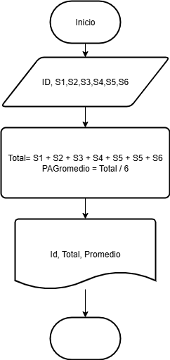
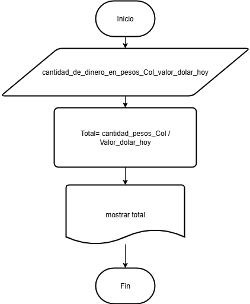

# Ejercicios

total semestre y el promedio mensual e imprima el ID del empleado

## Pseudocodigo

```
Inicio
Leer Id, S1, S2, S3, S4, S5, S6
Total= S1 + S2 + S3 + S4 + S5 + S6
Promedio = Total / 6
Mostrar ID, Total, Promedio
Fin
```
## Diagrama de flujo



## ejercicio 3

Una empresa importadora desea determinar cuántos dólares puede 
adquirir con equis cantidad de dinero colombiano. Realice un diagrama 
de flujo y pseudocódigo que representen el algoritmo para tal fin.

``` 
Inicio
Leer cantidad_de_dinero_en_pesos_Col, valor_dolar_hoy
Total = cantidad_pesos_Col /valor_dolar_hoy
Mostrar Total 
Fin 
```


